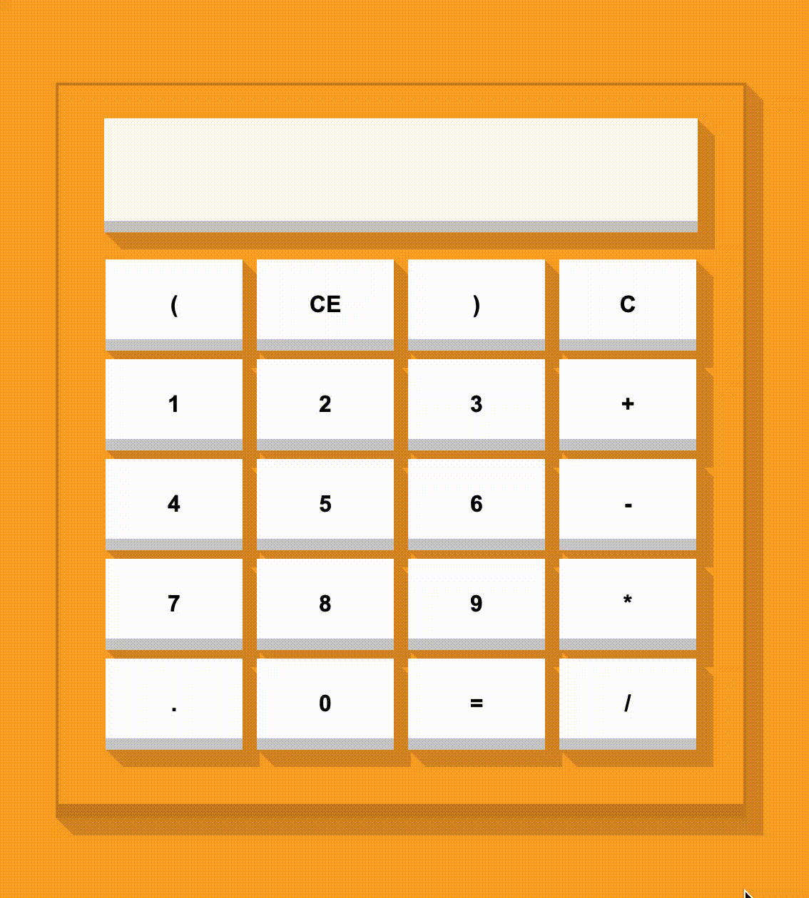

## [1 Day 1 Project](https://github.com/bugxvii/OneDay_OneProject) 

Day 4: Calculator

## Description
Create a web based Calculator.

## SPEC
- HTML 5
- CSS
- TypeScript (not yet)
- React
  + [Create React App](https://github.com/facebook/create-react-app)
  + Hooks (not yet)

## Reference
- [Button - Codepen](https://codepen.io/RafaelDeJongh/pen/pNEZgO?editors=0110)
